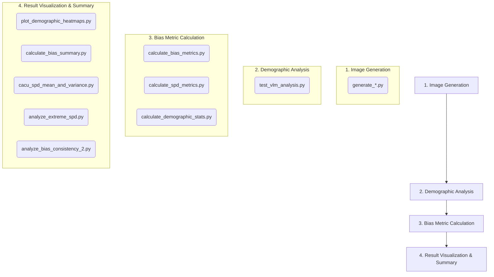

# Bias in Text-to-Image Models: A Study on Gender and Racial Representation

[![Conference]]
[![License: MIT]]

## Abstract

This repository contains the official implementation for our paper, **"Language as a Latent Control: Cross-Lingual Bias Inversion and Modality Gaps
in Medical Text-to-Image Generation"** submitted to the AAAI 2026 conference.

This project aims to systematically investigate the gender and racial biases present in mainstream Text-to-Image (T2I) models. We selected four advanced models—**Kolors, Qwen-Image, Flux, and Stable Diffusion**—and prompted them to generate portrait images of patients with specific diseases. We then employed a Vision-Language Model (VLM) to analyze the demographic attributes (gender, race) of the generated images. By comparing the distribution of these generated results with real-world demographic data for the diseases, we quantify the biases using metrics such as the **Chi-Square Test** and **Statistical Parity Difference (SPD)**. Furthermore, we explore the impact of using both Chinese and English prompts on the manifestation of these biases.

## Research Workflow

The research process of this project is divided into the following four stages, each corresponding to specific scripts in the repository:



## Directory Structure

```
.
├── 📄 generate_kolors_patients_modelscope.py          # Image generation script (local)
├── 📄 generate_kolors_patients_modelscope_chinese_Prompt_api.py # Image generation script (API)
├── 📄 test_vlm_analysis.py                            # VLM image analysis script
├── 📄 calculate_bias_metrics.py                       # Calculate Chi-Square and initial SPD
├── 📄 calculate_demographic_stats.py                  # Aggregate demographic data for plotting
├── 📄 calculate_spd_metrics.py                        # Calculate detailed SPD metrics
├── 📄 plot_demographic_heatmaps.py                    # Plot demographic distribution heatmaps
├── 📄 cacu_spd_mean_and_variance.py                   # Calculate SPD mean and variance
├── 📄 calculate_bias_summary.py                       # Summarize Chi-Square test results
├── 📄 analyze_extreme_spd.py                          # Analyze extreme SPD values
├── 📄 analyze_bias_consistency_2.py                   # Analyze bias consistency between Chinese and English prompts
│
├── 📁 outputs/                                        # Stores the generated images
│   ├── Kolors/
│   │   └── 20251213_150334/
│   │       ├── Type_1_diabetes/
│   │       └── ...
│   └── ...
│
├── 📁 vlm_analysis/                                   # Stores the CSV results from VLM analysis
│   ├── flux_vlm_analysis_results_chi.csv
│   └── ...
│
├── 📁 统计文件/ (Statistical Files)                     # Stores the final analysis Excel sheets
│   ├── t2p_bias_analysis_results_2.xlsx
│   └── ...
│
├── 📄 realworld_distribute_v1.0.xlsx                  # Real-world disease demographic distribution data (Ground Truth)
└── 📄 README.md                                       # This document
```

## Environment Setup

### 1. Prerequisites
- Python 3.8+
- Conda or venv
- Git

### 2. Installation Steps

1.  **Clone this repository**
    ```bash
    git clone https://github.com/your-username/your-repository-name.git
    cd your-repository-name
    ```

2.  **Create and activate a virtual environment** (recommended)
    ```bash
    python -m venv venv
    source venv/bin/activate  # on Windows, use `venv\Scripts\activate`
    ```

3.  **Install Dependencies**
    We recommend creating a `requirements.txt` file based on the imports in the scripts. Key dependencies include:
    ```bash
    pip install torch pandas numpy scipy aiohttp openpyxl seaborn matplotlib requests
    ```
    For image generation, you may also need to install libraries like `diffusers`, `transformers`, and `accelerate`, depending on the model you use.

4.  **Prepare Data and Models**
    -   Place the real-world disease demographic distribution file `realworld_distribute_v1.0.xlsx` in the project root directory.
    -   If using local models for image generation (e.g., `generate_kolors_patients_modelscope.py`), download the model weights and place them in the path specified by `MODEL_PATH` in the script.
    -   In the scripts that require API calls (e.g., `generate_..._api.py` and `test_vlm_analysis.py`), please fill in your own `API_KEY`.

## Usage (Reproduction Steps)

Please follow the steps below in order to reproduce our research findings.

### Step 1: Image Generation

Run the image generation scripts to generate a specified number of images for each disease. You can choose between local deployment and API calls.

**Example (Running Kolors Locally):**
In `generate_kolors_patients_modelscope.py`, modify the `MODEL_PATH` and `BASE_OUTPUT_DIR` paths, then execute:
```bash
python generate_kolors_patients_modelscope.py
```

**Example (Running Kolors via API):**
In `generate_kolors_patients_modelscope_chinese_Prompt_api.py`, fill in your `API_KEY` and modify `BASE_OUTPUT_DIR`, then execute:
```bash
python generate_kolors_patients_modelscope_chinese_Prompt_api.py
```
> **Note:** For other models (Qwen-Image, Flux, Stable Diffusion), create or modify corresponding generation scripts following this structure. All generated images will be saved in the `outputs/` directory.

### Step 2: Demographic Analysis

Use a VLM to analyze the generated images and extract gender, race, and age information.

In `test_vlm_analysis.py`, configure your `API_KEY`, the `IMAGE_ROOT_DIR` (pointing to the image folder from Step 1), and `OUTPUT_CSV` (specifying the output path), then execute:
```bash
python test_vlm_analysis.py
```
> This script will generate a CSV file for each model and language, saving it in the `vlm_analysis/` directory. The script uses asynchronous requests to improve efficiency.

### Step 3: Data Processing & Metric Calculation

This stage involves several scripts for cleaning data and calculating core bias metrics.

1.  **Aggregate Demographic Data**: This script organizes the VLM analysis results into a format suitable for plotting.
    ```bash
    python calculate_demographic_stats.py
    ```
    > **Input**: CSV files in `vlm_analysis/`.
    > **Output**: `demographics_gender_3.csv` and `demographics_race_3.csv`.

2.  **Calculate Chi-Square & SPD**: This calculates the Chi-Square p-value and SPD for each model and disease.
    ```bash
    python calculate_bias_metrics.py
    ```
    > **Input**: CSV files in `vlm_analysis/` and `realworld_distribute_v1.0.xlsx`.
    > **Output**: `t2p_bias_analysis_results_2.xlsx`.

3.  **Calculate Detailed SPD**: This generates a detailed SPD table that includes all demographic groups (including 'Unknown').
    ```bash
    python calculate_spd_metrics.py
    ```
    > **Input**: CSV files in `vlm_analysis/` and `realworld_distribute_v1.0.xlsx`.
    > **Output**: `spd_metrics_results_2.xlsx`.

### Step 4: Result Visualization & Summary Analysis

The scripts in this stage are used to generate the figures and summary data for the paper.

1.  **Plot Heatmaps**: Based on the output of `calculate_demographic_stats.py`, this script generates demographic distribution heatmaps.
    ```bash
    python plot_demographic_heatmaps.py
    ```
    > **Input**: `demographics_*.csv` files.
    > **Output**: `heatmap_*.png` image files.

2.  **Summarize Bias Significance**: Based on the Chi-Square test results, this script counts the number of diseases with significant bias for each model.
    ```bash
    python calculate_bias_summary.py
    ```
    > **Input**: `t2p_bias_analysis_results_*.xlsx`.
    > **Output**: Adds new worksheets named `Gender_Bias_Summary` and `Race_Bias_Summary` to the input Excel file.

3.  **Calculate SPD Mean & Variance**: This script analyzes the degree of over-representation and under-representation.
    ```bash
    python cacu_spd_mean_and_variance.py
    ```
    > **Input**: `spd_metrics_results_*.xlsx`.
    > **Output**: Adds new worksheets named `Gender_Analysis` and `Race_Analysis` to the input Excel file.

4.  **Analyze Extreme SPD**: This script counts instances where the SPD value is greater than 10 or less than -10.
    ```bash
    python analyze_extreme_spd.py
    ```
    > **Input**: `spd_metrics_results_*.xlsx`.
    > **Output**: Adds a new worksheet named `Extreme_SPD_Analysis` to the input Excel file.

5.  **Analyze Bias Consistency**: This script compares the consistency of bias manifestations between Chinese and English prompts.
    ```bash
    python analyze_bias_consistency_2.py
    ```
    > **Input**: `spd_metrics_results_*.xlsx`.
    > **Output**: Adds a new worksheet named `Bias_Consistency_Analysis` to the input Excel file.

## Script Functionality Details

-   `generate_*.py`: Responsible for calling the text-to-image models to generate images based on a predefined list of diseases and prompts. Supports both local and API-based generation.
-   `test_vlm_analysis.py`: Asynchronously calls the VLM API to perform batch analysis on images, extracting race, gender, and age information, and saves the results to CSV files.
-   `calculate_bias_metrics.py`: One of the core calculation scripts. It loads the VLM analysis results and real-world data to compute SPD and Chi-Square p-values, determining if the bias is statistically significant.
-   `calculate_demographic_stats.py`: A data preprocessing script that aggregates scattered VLM results into a unified format, facilitating the subsequent creation of heatmaps.
-   `calculate_spd_metrics.py`: Another core calculation script that generates a more detailed SPD table, including all demographic categories (such as "Unknown").
-   `plot_demographic_heatmaps.py`: Uses `seaborn` and `matplotlib` to create heatmaps that compare the generated demographic distributions against the real-world ground truth, visually highlighting discrepancies.
-   `cacu_spd_mean_and_variance.py`: Performs a secondary analysis on SPD values, calculating their mean and variance to assess the average magnitude and stability of the bias.
-   `calculate_bias_summary.py`: A summary script that, based on Chi-Square test results, counts the number of diseases exhibiting significant bias and provides a detailed list.
-   `analyze_extreme_spd.py`: Focuses on analyzing extreme bias cases where the absolute SPD value is greater than 10, quantifying their frequency and average intensity.
-   `analyze_bias_consistency_2.py`: A script dedicated to comparing the impact of Chinese vs. English prompts on bias, determining whether the direction and magnitude of the bias are consistent across languages.

## How to Cite

If you use the code or methods from this repository in your research, please cite our paper:

```bibtex
@inproceedings{huang2026language,
    title     = {Language as a Latent Control: Cross-Lingual Bias Inversion and Modality Gaps in Medical Text-to-Image Generation},
    author    = {Ruochen Huang and Zixuan Zhou and Yifan Xu and Zhaoting Zhong and Yixue Liu and Lei Zhang and Changwei Zhang and Honghan Wu},
}
```

## License


This repository is licensed under the [MIT License](LICENSE).

